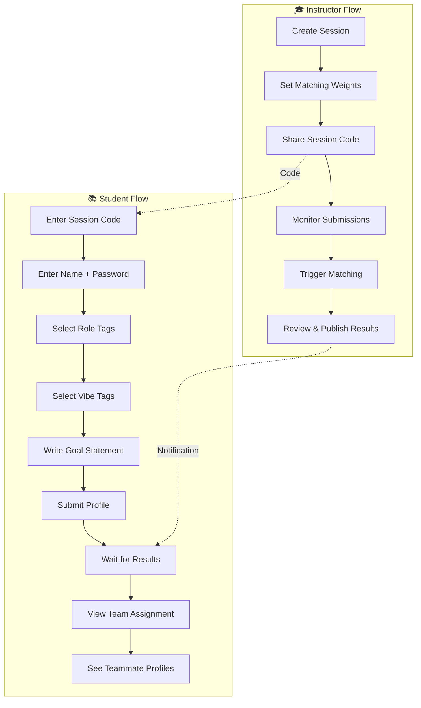
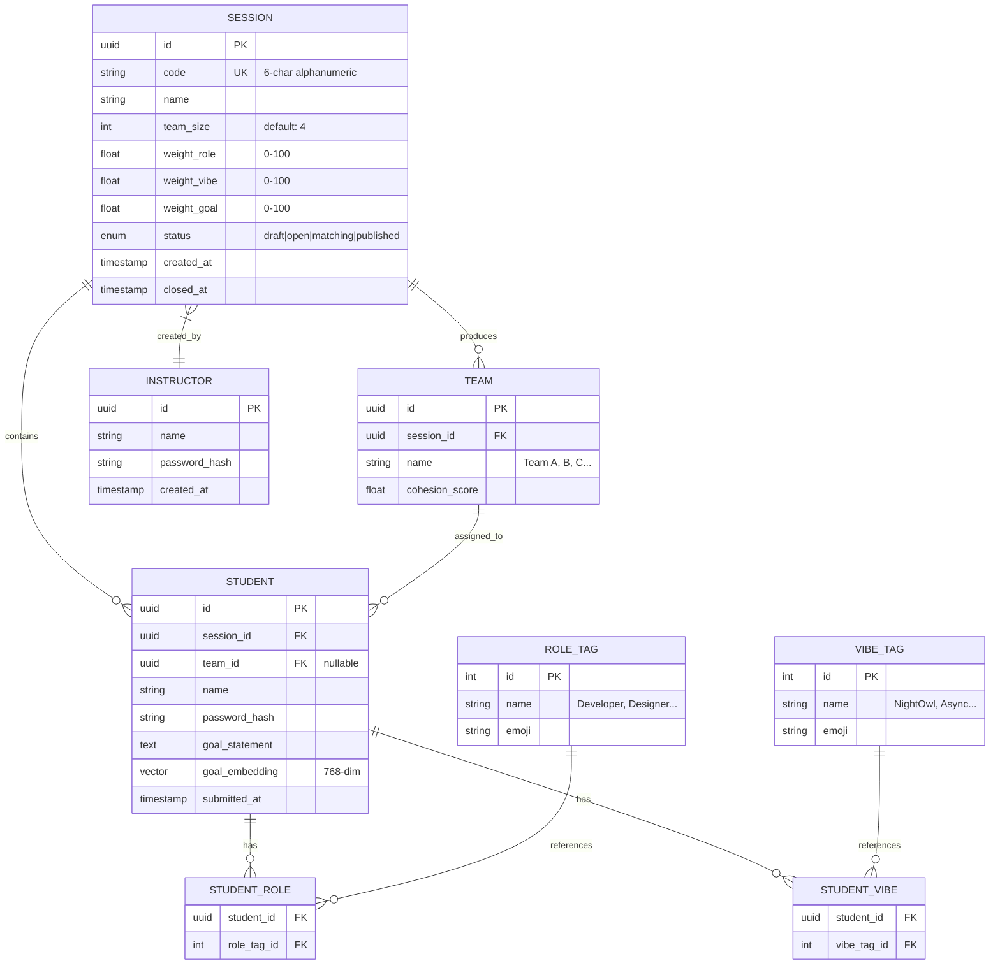

# Who-To: Team-Building Matching System Design

A web-based team-building solution for university classes that solves the "random teammate lottery" problem using algorithmic matching based on instructor-defined weights.

---

## 1. UX Flow & User Journey

### 1.1 User Roles

| Role | Capabilities |
|------|-------------|
| **Instructor** | Create sessions, set weights, view all profiles, trigger matching, publish results |
| **Student** | Join sessions, fill profile, view team results & teammates' private info |

### 1.2 Complete User Flow



### 1.3 Screen Flow (Single-Page Design)

````carousel
**Screen 1: Landing / Session Entry**
```
┌────────────────────────────────────────┐
│           🤝 WHO-TO                    │
│     Find Your Perfect Team             │
│                                        │
│  ┌──────────────────────────────────┐  │
│  │ Enter Session Code: [________]   │  │
│  └──────────────────────────────────┘  │
│                                        │
│  ─────── or ───────                    │
│                                        │
│  [Create New Session (Instructor)]     │
└────────────────────────────────────────┘
```
<!-- slide -->
**Screen 2: Profile Input (Minimal Steps)**
```
┌────────────────────────────────────────┐
│  Step 1/4 │ ●○○○ │ Your Identity      │
├────────────────────────────────────────┤
│  Name: [________________]              │
│  Password: [____________]              │
│  (Used only for re-entry)              │
│                                        │
│             [Next →]                   │
└────────────────────────────────────────┘
```
<!-- slide -->
**Screen 3: Role Selection**
```
┌────────────────────────────────────────┐
│  Step 2/4 │ ●●○○ │ Your Skills        │
├────────────────────────────────────────┤
│  What can you bring to the team?       │
│                                        │
│  ┌─────────┐ ┌─────────┐ ┌─────────┐   │
│  │💻 Dev   │ │🎨 Design│ │📊 Data  │   │
│  └─────────┘ └─────────┘ └─────────┘   │
│  ┌─────────┐ ┌─────────┐ ┌─────────┐   │
│  │🎤 Present│ │📝 Write │ │🔬Research│  │
│  └─────────┘ └─────────┘ └─────────┘   │
│                                        │
│        [← Back]    [Next →]            │
└────────────────────────────────────────┘
```
<!-- slide -->
**Screen 4: Vibe Selection**
```
┌────────────────────────────────────────┐
│  Step 3/4 │ ●●●○ │ Work Style         │
├────────────────────────────────────────┤
│  How do you like to work?              │
│                                        │
│  ┌─────────┐ ┌─────────┐ ┌─────────┐   │
│  │🌙 Night │ │☀️ Morning│ │🔄 Async │   │
│  └─────────┘ └─────────┘ └─────────┘   │
│  ┌─────────┐ ┌─────────┐ ┌─────────┐   │
│  │👑 Leader│ │🤝 Collab │ │🎯 Focus │   │
│  └─────────┘ └─────────┘ └─────────┘   │
│                                        │
│        [← Back]    [Next →]            │
└────────────────────────────────────────┘
```
<!-- slide -->
**Screen 5: Goal Statement**
```
┌────────────────────────────────────────┐
│  Step 4/4 │ ●●●● │ Your Goals         │
├────────────────────────────────────────┤
│  What do you want to achieve?          │
│                                        │
│  ┌──────────────────────────────────┐  │
│  │ I want to build a portfolio      │  │
│  │ project and learn from peers     │  │
│  │ who have different backgrounds...│  │
│  └──────────────────────────────────┘  │
│  (This helps us match motivation)      │
│                                        │
│        [← Back]    [Submit ✓]          │
└────────────────────────────────────────┘
```
<!-- slide -->
**Screen 6: Results View (Public + Private)**
```
┌────────────────────────────────────────┐
│  🎉 Your Team: Team Alpha              │
├────────────────────────────────────────┤
│  ┌──────────────────────────────────┐  │
│  │ 👤 Sarah (You)                   │  │
│  │ 💻 Dev, 🎨 Design | 🌙 Night     │  │
│  │ "Build portfolio & learn..."     │  │
│  └──────────────────────────────────┘  │
│  ┌──────────────────────────────────┐  │
│  │ 👤 Mike                          │  │
│  │ 📊 Data, 📝 Write | 🌙 Night    │  │
│  │ "Create impactful data viz..."   │  │
│  └──────────────────────────────────┘  │
│  ┌──────────────────────────────────┐  │
│  │ 👤 Lisa                          │  │
│  │ 🎤 Present | 🌙 Night, 🤝 Collab │  │
│  │ "Practice pitching ideas..."     │  │
│  └──────────────────────────────────┘  │
│                                        │
│  [View Compatibility Map 🗺️]           │
└────────────────────────────────────────┘
```
````

---

## 2. Database Schema

### 2.1 Entity Relationship Diagram



### 2.2 Schema Details

| Table | Key Fields | Notes |
|-------|-----------|-------|
| `session` | `code`, `weight_*`, `status` | Weights must sum to 100 |
| `student` | `goal_embedding` | Generated via embedding API (e.g., OpenAI, Gemini) |
| `team` | `cohesion_score` | Average pairwise compatibility within team |

---

## 3. Matching Algorithm

### 3.1 Algorithm Overview

The matching algorithm optimizes for:
1. **Role Diversity** → Teams should have complementary skills
2. **Vibe Similarity** → Teams should have compatible work styles
3. **Goal Alignment** → Teams should have similar motivations

### 3.2 Pseudocode

```python
# ═══════════════════════════════════════════════════════════
# WHO-TO MATCHING ALGORITHM
# ═══════════════════════════════════════════════════════════

def calculate_pairwise_score(student_a, student_b, weights):
    """
    Calculate compatibility score between two students.
    Higher score = better match for same team.
    
    Args:
        student_a, student_b: Student objects
        weights: {role: float, vibe: float, goal: float} summing to 1.0
    
    Returns:
        float: Compatibility score between 0 and 1
    """
    
    # ─────────────────────────────────────────────────────────
    # 1. ROLE DIVERSITY SCORE (higher when roles are DIFFERENT)
    # ─────────────────────────────────────────────────────────
    roles_a = set(student_a.role_tags)
    roles_b = set(student_b.role_tags)
    
    # Jaccard distance: 1 - (intersection / union)
    # More diversity = higher score
    if roles_a or roles_b:
        role_overlap = len(roles_a & roles_b) / len(roles_a | roles_b)
        role_diversity_score = 1 - role_overlap
    else:
        role_diversity_score = 0.5  # neutral
    
    # ─────────────────────────────────────────────────────────
    # 2. VIBE SIMILARITY SCORE (higher when vibes are SIMILAR)
    # ─────────────────────────────────────────────────────────
    vibes_a = set(student_a.vibe_tags)
    vibes_b = set(student_b.vibe_tags)
    
    # Jaccard similarity: intersection / union
    # More similarity = higher score
    if vibes_a or vibes_b:
        vibe_similarity_score = len(vibes_a & vibes_b) / len(vibes_a | vibes_b)
    else:
        vibe_similarity_score = 0.5  # neutral
    
    # ─────────────────────────────────────────────────────────
    # 3. GOAL ALIGNMENT SCORE (semantic similarity)
    # ─────────────────────────────────────────────────────────
    # Cosine similarity between goal embeddings
    goal_alignment_score = cosine_similarity(
        student_a.goal_embedding,
        student_b.goal_embedding
    )
    # Normalize to [0, 1] range
    goal_alignment_score = (goal_alignment_score + 1) / 2
    
    # ─────────────────────────────────────────────────────────
    # 4. WEIGHTED FINAL SCORE
    # ─────────────────────────────────────────────────────────
    final_score = (
        weights['role'] * role_diversity_score +
        weights['vibe'] * vibe_similarity_score +
        weights['goal'] * goal_alignment_score
    )
    
    return final_score


def build_compatibility_matrix(students, weights):
    """
    Build NxN matrix of pairwise compatibility scores.
    """
    n = len(students)
    matrix = [[0.0] * n for _ in range(n)]
    
    for i in range(n):
        for j in range(i + 1, n):
            score = calculate_pairwise_score(
                students[i], students[j], weights
            )
            matrix[i][j] = score
            matrix[j][i] = score  # symmetric
    
    return matrix


def greedy_team_formation(students, team_size, compat_matrix):
    """
    Greedy algorithm for team formation.
    Time: O(n² * team_size)
    
    For production, consider:
    - Simulated Annealing
    - Genetic Algorithm
    - Integer Linear Programming (ILP)
    """
    n = len(students)
    num_teams = ceil(n / team_size)
    
    assigned = [False] * n
    teams = []
    
    for t in range(num_teams):
        team = []
        
        # Find the best seed (unassigned student with highest avg compatibility)
        if not team:
            best_seed = -1
            best_avg = -1
            for i in range(n):
                if not assigned[i]:
                    avg_compat = sum(compat_matrix[i]) / n
                    if avg_compat > best_avg:
                        best_avg = avg_compat
                        best_seed = i
            
            team.append(best_seed)
            assigned[best_seed] = True
        
        # Greedily add members that maximize team cohesion
        while len(team) < team_size and sum(not a for a in assigned) > 0:
            best_candidate = -1
            best_score = -1
            
            for candidate in range(n):
                if assigned[candidate]:
                    continue
                
                # Score = average compatibility with current team members
                avg_with_team = sum(
                    compat_matrix[candidate][member] 
                    for member in team
                ) / len(team)
                
                if avg_with_team > best_score:
                    best_score = avg_with_team
                    best_candidate = candidate
            
            if best_candidate >= 0:
                team.append(best_candidate)
                assigned[best_candidate] = True
        
        teams.append(team)
    
    return teams


def optimize_teams(teams, compat_matrix, iterations=1000):
    """
    Local search optimization via swap moves.
    Try swapping members between teams to improve overall score.
    """
    def team_cohesion(team):
        if len(team) < 2:
            return 0
        total = sum(
            compat_matrix[team[i]][team[j]]
            for i in range(len(team))
            for j in range(i + 1, len(team))
        )
        pairs = len(team) * (len(team) - 1) / 2
        return total / pairs
    
    def total_score(teams):
        return sum(team_cohesion(t) for t in teams)
    
    best_score = total_score(teams)
    
    for _ in range(iterations):
        # Pick two random teams
        t1, t2 = random.sample(range(len(teams)), 2)
        if not teams[t1] or not teams[t2]:
            continue
        
        # Pick random members to swap
        m1 = random.choice(range(len(teams[t1])))
        m2 = random.choice(range(len(teams[t2])))
        
        # Try swap
        teams[t1][m1], teams[t2][m2] = teams[t2][m2], teams[t1][m1]
        new_score = total_score(teams)
        
        if new_score > best_score:
            best_score = new_score  # Keep swap
        else:
            # Revert swap
            teams[t1][m1], teams[t2][m2] = teams[t2][m2], teams[t1][m1]
    
    return teams


# ═══════════════════════════════════════════════════════════
# MAIN MATCHING PIPELINE
# ═══════════════════════════════════════════════════════════

def match_students(session):
    """
    Main entry point for matching algorithm.
    """
    # 1. Normalize weights
    total = session.weight_role + session.weight_vibe + session.weight_goal
    weights = {
        'role': session.weight_role / total,
        'vibe': session.weight_vibe / total,
        'goal': session.weight_goal / total
    }
    
    # 2. Get all students with embeddings
    students = get_students_with_embeddings(session.id)
    
    # 3. Build compatibility matrix
    compat_matrix = build_compatibility_matrix(students, weights)
    
    # 4. Initial team formation
    teams = greedy_team_formation(
        students, 
        session.team_size, 
        compat_matrix
    )
    
    # 5. Optimize via local search
    teams = optimize_teams(teams, compat_matrix)
    
    # 6. Calculate final cohesion scores
    results = []
    for i, team_indices in enumerate(teams):
        team_name = f"Team {chr(65 + i)}"  # Team A, B, C...
        cohesion = calculate_team_cohesion(team_indices, compat_matrix)
        results.append({
            'name': team_name,
            'members': [students[i] for i in team_indices],
            'cohesion_score': cohesion
        })
    
    return results
```

### 3.3 Algorithm Complexity

| Phase | Time Complexity | Notes |
|-------|----------------|-------|
| Pairwise Scoring | O(n²) | Unavoidable for full matrix |
| Greedy Formation | O(n² × team_size) | Fast approximation |
| Local Search Optimization | O(iterations × team_size²) | Tunable iterations |
| **Total** | **O(n²)** | Scales well for class sizes (< 500) |

---

## 4. Visualization Specifications

### 4.1 3D Node-Link Diagram

For the compatibility visualization, implement using **Three.js** or **React Three Fiber**:

```
┌─────────────────────────────────────────────────────────┐
│                  3D Visualization View                   │
│                                                          │
│       ○ Student A                                        │
│        \                                                 │
│         \  (strong link)                                 │
│          \                                               │
│           ○ Student B ─────── ○ Student C               │
│          /    (weak link)                                │
│         /                                                │
│        ○ Student D                                       │
│                                                          │
│  Legend:                                                 │
│  ● Same Team (colored by team)                          │
│  ─ Thick line = High compatibility                      │
│  ┄ Thin line = Low compatibility                        │
└─────────────────────────────────────────────────────────┘
```

### 4.2 Visual Encoding

| Element | Encoding | Purpose |
|---------|----------|---------|
| **Node color** | Team assignment | Quick team identification |
| **Node size** | Number of connections | Identify highly compatible students |
| **Edge thickness** | Compatibility score | Show relationship strength |
| **Edge opacity** | Score threshold | Hide weak connections |
| **Cluster position** | Force-directed layout | Natural grouping |

### 4.3 Interaction Design

1. **Hover** → Show student name + tags
2. **Click** → Highlight all connections to that student
3. **Zoom** → Focus on specific clusters
4. **Filter** → Toggle by team or score threshold

---

## 5. Privacy & Information Hierarchy

| Data | Visibility | Implementation |
|------|------------|---------------|
| Name | Public | Shown in results list |
| Team Assignment | Public | Main results view |
| Role Tags | **Teammates Only** | Revealed after team assignment |
| Vibe Tags | **Teammates Only** | Revealed after team assignment |
| Goal Statement | **Teammates Only** | Revealed after team assignment |
| Compatibility Score | Instructor Only | Admin dashboard |

---

## 6. Technical Stack Recommendation

| Layer | Technology | Rationale |
|-------|------------|-----------|
| **Frontend** | Next.js + React | Single-page app, SSR for SEO |
| **Styling** | Vanilla CSS + CSS Variables | When2Meet-like simplicity |
| **3D Viz** | Three.js / React Three Fiber | Industry standard for web 3D |
| **Backend** | Next.js API Routes | Unified deployment |
| **Database** | PostgreSQL + pgvector | Vector similarity for embeddings |
| **Embedding** | OpenAI / Gemini API | Semantic goal analysis |
| **Hosting** | Vercel | Edge deployment, easy scaling |

---

## Verification Plan

### Automated Tests
- Unit tests for matching algorithm scoring functions
- Integration tests for API endpoints
- End-to-end tests for complete user flows

### Manual Verification
1. **Instructor Flow**: Create session → Set weights → Share code → Trigger matching
2. **Student Flow**: Join session → Fill profile → Submit → View results
3. **Privacy Check**: Verify teammate-only data is hidden from non-teammates

---

> [!IMPORTANT]
> This is a design document for review. Please confirm if you'd like me to proceed with implementation or if you have any modifications to the UX flow, database schema, or algorithm.
