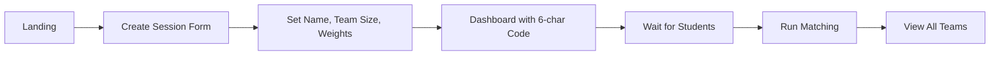
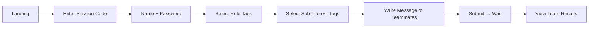

# Who-To V2: Final MVP PRD

## Overview

**Who-To** is a team matching app for classrooms and workshops. Instructors create sessions, students join and submit profiles, then teams are automatically formed based on skill diversity and interest alignment.

**Tech Stack**: Plain HTML + CSS + JavaScript (no frameworks, no build step)

---

## User Roles

| Role | Description |
|------|-------------|
| **Instructor** | Creates session, configures weights, runs matching, views all teams |
| **Student** | Joins session, selects tags, writes message, views assigned team |

---

## User Flows

### Flow 1: Instructor Creates Session



### Flow 2: Student Joins & Submits



---

## Tags (Final)

### Role Tags (5 items)
| ID | Name | Emoji |
|----|------|-------|
| `engineer` | Engineer | 💻 |
| `researcher` | Researcher | 🔬 |
| `data-analyst` | Data Analyst | 📊 |
| `designer` | Designer | 🎨 |
| `speech-giver` | Speech Giver | 🎤 |

### Sub-interest Tags (5 items + custom)
| ID | Name | Emoji |
|----|------|-------|
| `health-care` | Health Care | 🏥 |
| `edu-tech` | Edu Tech | 📚 |
| `fin-tech` | Fin Tech | 💰 |
| `social-impact` | Social Impact | 🌍 |
| `others` | Others | ✏️ |

> When user selects "Others", a text input appears for custom entry.

---

## Matching Algorithm (Simplified)

### Inputs Used for Matching
- ✅ **Role Tags** → Diversity scoring (different roles = higher score)
- ✅ **Sub-interest Tags** → Similarity scoring (same interests = higher score)
- ❌ **Message to Teammates** → NOT used in matching (display only)

### Pairwise Score Formula
```
score = (weight_role × role_diversity) + (weight_interest × interest_similarity)

role_diversity = 1 - jaccard_similarity(roleA, roleB)
interest_similarity = jaccard_similarity(interestA, interestB)
```

### Team Formation
1. Build NxN compatibility matrix
2. Greedy: Pick seed, add best-compatible members
3. Optimize: Random swaps to improve total score

---

## Data Structures

### Session
```javascript
{
  id: "uuid",
  code: "AB3D7K",
  name: "CS101 Spring 2024",
  teamSize: 4,
  weightRole: 50,      // percentage
  weightInterest: 50,  // percentage (must sum to 100)
  status: "open" | "published",
  students: [],
  teams: []
}
```

### Student
```javascript
{
  id: "uuid",
  name: "Alice",
  password: "simple123",
  roleTagIds: ["engineer", "designer"],
  interestTagIds: ["edu-tech", "social-impact"],
  customInterest: "",  // if "others" selected
  messageToTeam: "Looking forward to building something cool!",
  teamId: null
}
```

### Team
```javascript
{
  id: "uuid",
  name: "Team A",
  memberIds: ["s1", "s2", "s3"],
  cohesionScore: 0.85
}
```

---

## Screens (7 Views)

| Screen | Description |
|--------|-------------|
| `landing` | Session code input + Create button |
| `join-session` | Name + Password form |
| `create-session` | Instructor form |
| `profile-input` | Multi-step: Roles → Interests → Message |
| `waiting` | "Waiting for teams..." |
| `instructor-dashboard` | Code display, Run Matching button |
| `results` | Team cards with members |

---

## File Structure

```
who-to-v2/
├── index.html      # Single page app
├── style.css       # Minimal CSS (structure first)
├── app.js          # State, rendering, matching
├── PRD.md          # This document
├── DESIGN_V1.md    # Original design reference
└── README.md       # How to use
```

---

## What's NOT Included (Intentionally)

| Feature | Status |
|---------|--------|
| 3D Visualization | ❌ Removed permanently |
| Goal embeddings | ❌ Not needed |
| Real-time updates | ❌ Manual refresh instead |
| Database | ❌ In-memory only |

---

## Verification Plan

1. **Instructor Flow**: Create session → Get code → Dashboard works
2. **Student Flow**: Join → Profile steps → Waiting screen
3. **Matching**: Run matching → Teams displayed with scores
4. **File Size**: Confirm total < 50KB

---

## Ready to Build! 🚀

All specs are finalized. Proceeding with implementation.
