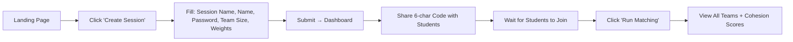
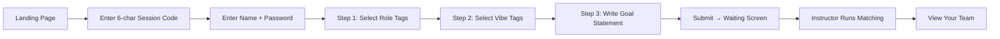
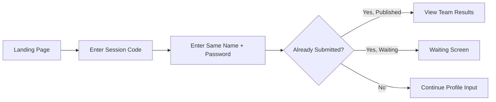

# Who-To V2: Product Requirements Document

## Overview

**Who-To** is a team matching application for classrooms and workshops. It helps instructors automatically form balanced teams based on students' skills, working styles (vibes), and goals.

**V2 Goal**: Rebuild as plain HTML/CSS/JS for:
- ✅ GitHub-uploadable (< 100KB total, no `node_modules`)
- ✅ Full codebase transparency and control
- ✅ Easy collaboration without build steps

---

## User Roles

| Role | Description |
|------|-------------|
| **Instructor** | Creates sessions, configures matching weights, runs matching, views all teams |
| **Student** | Joins sessions, submits profile (skills + vibes + goals), views their assigned team |

---

## User Flows

### Flow 1: Instructor Creates Session



### Flow 2: Student Joins & Submits Profile



### Flow 3: Returning Student



---

## Features

### Core Features (V2 MVP)

| Feature | Description |
|---------|-------------|
| **Session Creation** | Instructor creates a session with name, team size (2-10), and matching weights |
| **Session Code** | 6-character sharable code (e.g., `AB3D7K`) |
| **Student Registration** | Name + simple password for re-entry |
| **Role Tags Selection** | 8 predefined skills: Developer, Designer, Data Analyst, Presenter, Writer, Researcher, PM, Marketing |
| **Vibe Tags Selection** | 8 work style preferences: Night Owl, Morning Person, Async, Leader, Collaborator, Deep Focus, Flexible, Structured |
| **Goal Statement** | Free-text input describing project goals |
| **Matching Algorithm** | Weighted scoring: Role diversity + Vibe similarity + Goal alignment |
| **Team Display** | Show team name, members, tags, goals, cohesion score |

### V1 Features to Defer (Future)

| Feature | Reason to Defer |
|---------|-----------------|
| 3D Visualization | Requires Three.js, adds complexity |
| Goal Embeddings | Requires API call for semantic similarity |
| Polling/Real-time | Keep it simple, use manual refresh |

---

## Screens (8 Views)

| Screen | Description |
|--------|-------------|
| `landing` | Session code input + Create Session button |
| `join-session` | Name + Password form for students |
| `create-session` | Full instructor form with weights |
| `profile-input` | Multi-step form (Roles → Vibes → Goals) |
| `waiting` | "Waiting for instructor..." with refresh button |
| `instructor-dashboard` | Show session code, status, Run Matching button |
| `results` | Display teams and members |

---

## Data Structures

### Session
```javascript
{
  id: "uuid",
  code: "AB3D7K",
  name: "CS101 Spring 2024",
  teamSize: 4,
  weightRole: 40,
  weightVibe: 30,
  weightGoal: 30,
  status: "open" | "published",
  students: [...],
  teams: [...]
}
```

### Student
```javascript
{
  id: "uuid",
  name: "Alice",
  password: "simple123",
  roleTagIds: ["developer", "designer"],
  vibeTagIds: ["night-owl", "focused"],
  goalStatement: "I want to build a portfolio...",
  teamId: null | "team-uuid"
}
```

### Team
```javascript
{
  id: "uuid",
  name: "Team A",
  memberIds: ["student-1", "student-2", ...],
  cohesionScore: 0.85
}
```

---

## Matching Algorithm

### Pairwise Scoring (2 students)

1. **Role Diversity Score** = Jaccard Distance of role tags
   - Higher when students have *different* skills
   - `1 - (intersection / union)`

2. **Vibe Similarity Score** = Jaccard Similarity of vibe tags
   - Higher when students have *similar* work styles
   - `intersection / union`

3. **Goal Alignment Score** = Fixed 0.5 (no embeddings in V2)
   - Could use simple keyword matching in future

4. **Total Score** = `(weight_role × role) + (weight_vibe × vibe) + (weight_goal × goal)`

### Team Formation

1. Build NxN compatibility matrix for all students
2. Greedy algorithm: Pick seed student, add best-compatible members
3. Optimization: Random swap iterations to improve total score
4. Output: Teams with cohesion scores

---

## File Structure

```
who-to-v2/
├── index.html      # Single page, all screens rendered via JS
├── style.css       # Minimal styling (focus on structure)
├── app.js          # State, rendering, logic, matching algorithm
└── README.md       # How to use, collaborate, contribute
```

---

## Technical Decisions

| Decision | Rationale |
|----------|-----------|
| No framework | Full control, no build step, tiny file size |
| In-memory state | Simple JS object, no localStorage for now |
| Single HTML file | All screens are sections shown/hidden via JS |
| Vanilla CSS | No Tailwind, easier to understand and modify |
| ES6 modules | Clean code organization without bundler |

---

## Proposed Changes

### [NEW] [index.html](file:///Users/garycool/Desktop/Vibe%20code/who-to-v2/index.html)
- Semantic HTML structure for all 7 screens
- Meta tags, viewport settings
- Script/CSS imports

### [NEW] [style.css](file:///Users/garycool/Desktop/Vibe%20code/who-to-v2/style.css)
- CSS variables for colors, spacing
- Minimal layout styles
- Screen visibility controls

### [NEW] [app.js](file:///Users/garycool/Desktop/Vibe%20code/who-to-v2/app.js)
- State management object
- DOM rendering functions for each screen
- Event handlers
- Matching algorithm (ported from TypeScript)

### [NEW] [README.md](file:///Users/garycool/Desktop/Vibe%20code/who-to-v2/README.md)
- Project description
- How to run locally
- How to collaborate

---

## Verification Plan

### Manual Testing

After implementation, verify each user flow:

1. **Instructor Flow**:
   - Open `index.html` in browser
   - Click "Create Session"
   - Fill form and submit
   - Verify 6-char code appears on dashboard

2. **Student Flow**:
   - Open in new tab/incognito
   - Enter session code
   - Complete profile steps
   - Verify waiting screen appears

3. **Matching Flow**:
   - Return to instructor tab
   - Click "Run Matching"
   - Verify teams appear with cohesion scores

4. **File Size Check**:
   - Run `ls -la` on the folder
   - Verify total size < 50KB
   - Confirm no `node_modules` or build artifacts

---

## Questions for User

> [!IMPORTANT]
> Please confirm the following before I proceed:

1. **Scope Confirmation**: The 3D visualization will be deferred to a future version. Is this acceptable?

2. **Persistence**: Data will be lost on page refresh (in-memory only). Should I add `localStorage` support?

3. **Styling Approach**: I'll create minimal CSS for now, focusing on structure. You can add design polish later. Sound good?
